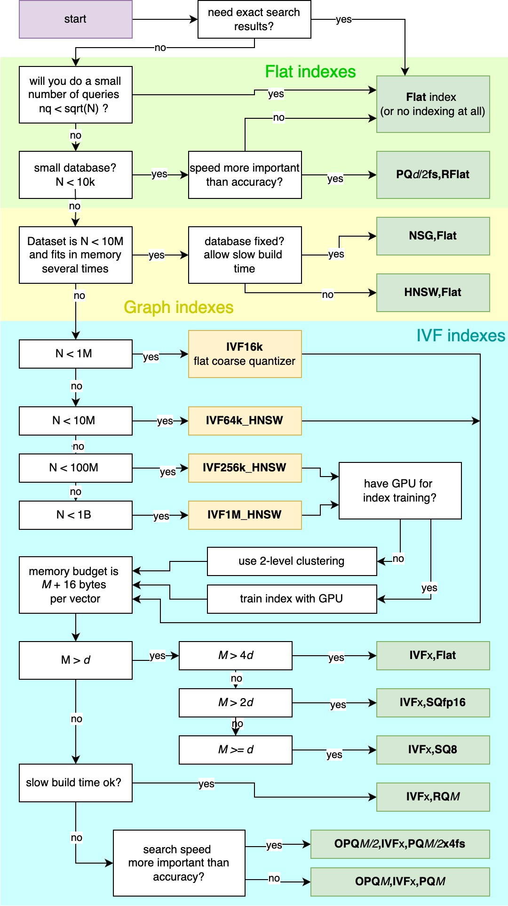

<!--
 * @Author: superestos superestos@gmail.com
 * @Date: 2025-07-04 08:48:09
 * @LastEditors: superestos superestos@gmail.com
 * @LastEditTime: 2025-07-05 16:38:25
 * @FilePath: /dry/faiss.wiki.cn/src/Guidelines-to-choose-an-index.md
 * @Description: 这是默认设置,请设置`customMade`, 打开koroFileHeader查看配置 进行设置: https://github.com/OBKoro1/koro1FileHeader/wiki/%E9%85%8D%E7%BD%AE
-->
Choosing an index is not obvious, so here are a few essential questions that can help in the choice of an index. They are mainly applicable for L2 distances. We indicate:

- the `index_factory` string for each of them.

- if there are parameters, we indicate them as the corresponding `ParameterSpace` argument.

See the bottom of the page for a summary decision tree. 

# Will you perform few searches?

If you plan to perform only a few searches (say 1000-10000), the index building time will not be amortized by the search time. Then direct computation is the most efficient option. 

This is done via a `"Flat"` index. If the whole dataset does not fit in RAM, you can build small indexes one after another, and combine the search results (see [Combining results of several searches](https://github.com/facebookresearch/faiss/wiki/Brute-force-search-without-an-index#combining-the-results-from-several-searches) on how to do this) . 

# Do you need exact results?

## Then: `"Flat"` 

The only index that can guarantee exact results is the IndexFlatL2 or IndexFlatIP. It provides the baseline for results for the other indexes. It does not compress the vectors, but does not add overhead on top of them. It does not support adding with ids (`add_with_ids`), only sequential adds, so if you need `add_with_ids`, use `"IDMap,Flat"`. The flat index does not require training and does not have parameters.

_Supported on GPU: yes_

# Is memory a concern? 

Keep in mind that all Faiss indexes are stored in RAM. The following considers that if exact results are not required, RAM is the limiting factor, and that within memory constraints we optimize the precision-speed tradeoff.

## If not: `HNSW`_M_ or `IVF1024,PQ`_N_`x4fs,RFlat`

If you have a lots of RAM or the dataset is small, HNSW is the best option, it is a very fast and accurate index. The 4 <= _M_ <= 64 is the number of links per vector, higher is more accurate but uses more RAM. The speed-accuracy tradeoff is set via the `efSearch` parameter. The memory usage is (_d_ * 4 + _M_ * 2 * 4) bytes per vector.

HNSW does only support sequential adds (not `add_with_ids`) so here again, prefix with `IDMap` if needed. HNSW does not require training and does not support removing vectors from the index. 

The second option is faster than HNSW. 
However it requires a re-ranking stage and thus there are two parameters to adjust: the `k_factor` of reranking and the `nprobe` of the IVF. 

_Supported on GPU: no_

## If somewhat, then `"...,Flat"` 

`"..."` means a clustering of the dataset has to be performed beforehand (read below). After clustering, `"Flat"` just organizes the vectors into buckets, so it does not compress them, the storage size is the same as that of the original dataset. The tradeoff between speed and accuracy is set via the `nprobe` parameter.

_Supported on GPU: yes (but see below, the clustering method must be supported as well)_

## If quite important, then `OPQ`_M_`_`_D_`,...,PQ`_M_`x4fsr` 

If storing the whole vectors is too expensive, this performs two operations: 

- an OPQ transform to dimension _D_ to reduce the dimension

- a PQ quantization of the vectors into _M_ 4-bit codes. 

Therefore the total storage is _M_/2 bytes per vector. 

_Supported on GPU: yes_

## If very important, then `OPQ`_M_`_`_D_`,...,PQ`_M_

`PQ`_M_ compresses the vectors using a product quantizer that outputs _M_-byte codes. _M_ is typically <= 64, for larger codes SQ is usually as accurate and faster. OPQ is a linear transformation of the vectors to make them easier to compress. _D_ is a dimension such that:

- _D_ is a multiple of _M_ (required)
- _D_ <= _d_, with _d_ the dimension of the input vectors (preferable)
- _D_ = 4*_M_ (preferable)

_Supported on GPU: yes (note: the OPQ transform is done on CPU, but it is not performance critical)_

# How big is the dataset? 

This question is used to fill in the clustering options (the `...` above). The dataset is clustered into buckets and at search time, only a fraction of the buckets are visited (`nprobe` buckets). The clustering is performed on a representative sample of the dataset vectors, typically a sample of the dataset. We indicate the optimal size for this sample.

## If below 1M vectors: `...,IVF`_K_`,...` 

Where _K_ is `4*sqrt(N)` to `16*sqrt(N)`, with N the size of the dataset. This just clusters the vectors with k-means. You will need between 30*_K_ and 256*_K_ vectors for training (the more the better).

_Supported on GPU: yes_

## If 1M - 10M: `"...,IVF65536_HNSW32,..."` 

IVF in combination with HNSW uses HNSW to do the cluster assignment. You will need between 30 * 65536 and 256 * 65536 vectors for training. 

_Supported on GPU: no (on GPU, use IVF as above)_

## If 10M - 100M: `"...,IVF262144_HNSW32,..."` 

Same as above, replace 65536 with 262144 (2^18). 

Note that training is going to be slow, to avoid this, there are two options: 

- do just the training on GPU, everything else running on CPU, see [train_ivf_with_gpu.ipynb](https://gist.github.com/mdouze/46d6bbbaabca0b9778fca37ed2bcccf6).

- do a two-level clustering, see [demo_two_level_clustering.ipynb](https://gist.github.com/mdouze/1b2483d72c0b8984dd152cd81354b7b4)

## If 100M - 1B: `"...,IVF1048576_HNSW32,..."` 

Same as above, replace 65536 with 1048576 (2^20). Training will be even slower!

